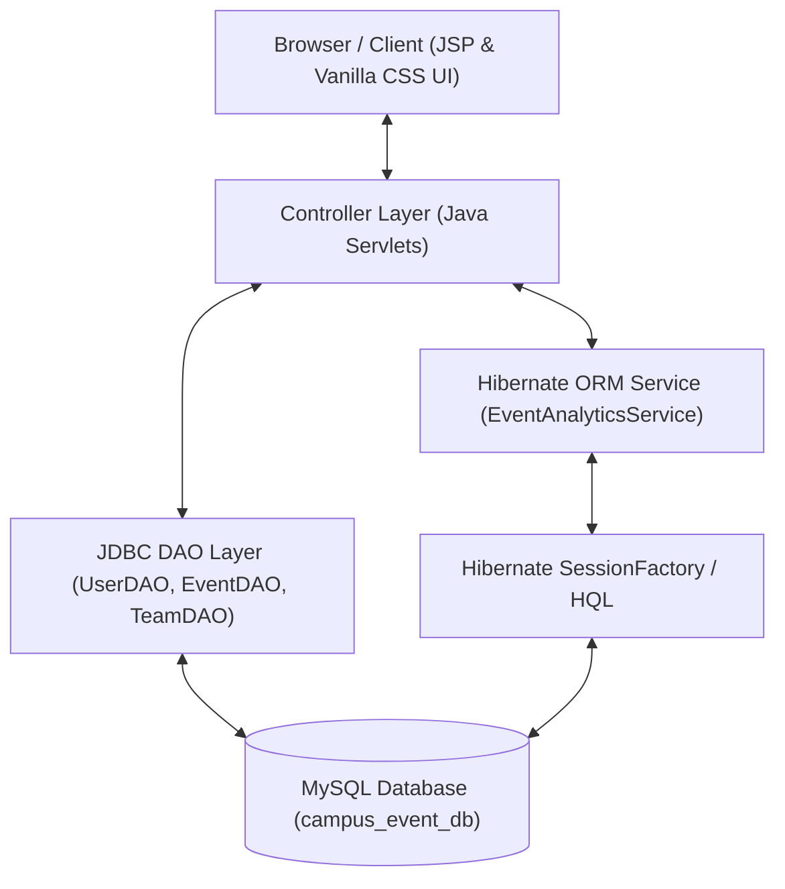

# Campus Event Management System (CEMS)
## Complete Software Requirement Specification (SRS) & System Architecture Document

**Course:** Bachelor of Technology / Computer Applications Enterprise Project  
**Subject:** Advanced Java Enterprise Web Programming  
**Architecture:** 3-Tier MVC Architecture (JSP → Servlets → JDBC & Hibernate ORM 5.4 → MySQL)  
**Security & UI:** SHA-256 Hashing, Session Guards, Enterprise Sidebar Navigation & High-Contrast Design System  

---

## 1. Executive Summary & Project Introduction

Educational institutions organize diverse technical symposiums, workshops, hackathons, guest lectures, cultural festivals, and sports competitions throughout the academic year. Managing these events through manual notices or uncoordinated online forms leads to communication gaps, duplicate enrollments, seat overbooking, and tedious attendee tracking.

The **Campus Event Management System (CEMS)** is a full-featured Java Enterprise Web Application designed to centralize event publishing, student registrations (for both **Individual** and **Team** events), real-time seat capacity allocation, multithreaded concurrency control, and ORM-powered analytics.

Built using core **Java Servlets, JSP, JDBC, MySQL**, and integrated with a **Hibernate 5.4 ORM Analytics Engine**, CEMS provides a high-performance platform for campus event operations.

---

## 2. Key Features & Capabilities

### 2.1 Student Portal & Registration Engine
- **User Authentication:** Secure registration and login using SHA-256 password hashing and HTTP Session management.
- **Event Catalog Browsing:** Real-time catalog listing published campus events, filtering by venue, title search, and live seat capacity calculations.
- **Individual Event Registration:** One-click registration for individual events with automatic seat deduction and duplicate prevention.
- **Team Event Registration:**
  - Create custom teams for group events (e.g., Hackathons, Esports, Cultural Groups).
  - Enforce event-specific minimum and maximum team size rules (`min_team_size` to `max_team_size`).
  - Search and add registered student team members by email address.
  - Automatic **Team Leader** badge assignment for team creators.
- **My Registrations Dashboard:** Unified portal showing all enrolled individual and team events, team member details, and cancellation controls.

### 2.2 Administrator Portal & Management Engine
- **Enterprise Sidebar Dashboard:** Modern fixed left navigation sidebar with category groupings, active tab indicators, and a dedicated Logout button.
- **Event Publishing:** Create **Individual** or **Team** events with date, time, venue, capacity, and team size boundaries.
- **Event Lifecycle Management:** View, search, edit schedules/capacities, or delete campus events with cascading cleanup.
- **Attendee Roster Control:** View complete student enrollment lists per event with timestamps and attendee contact details.

### 2.3 Hibernate 5.4 ORM Analytics Engine (`/admin/analytics`)
- **Real-Time HQL Reporting:** Advanced ORM analytics module powered by Hibernate Query Language (HQL) and JPA Annotations.
- **Capacity Utilization Analysis:** Calculates capacity percentages (`pct = enrolled / capacity * 100`) and visually highlights capacity thresholds.
- **Team Dynamics Analytics:** HQL aggregation queries reporting average team size, largest team size, and smallest team size for group events.
- **DTO Data Transfer Patterns:** Uses custom DTO objects (`EventSummaryDTO`, `EventAnalyticsDTO`) to decouple ORM queries from view rendering.

### 2.4 Multithreaded Concurrency & Safety Control
- Thread-safe seat allocation engine preventing race conditions and overbooking when multiple students attempt simultaneous registration for limited seats.

---

## 3. System Architecture & Component Design

### 3.1 Model-View-Controller (MVC) Pattern
CEMS adheres strictly to the 3-Tier Enterprise MVC Pattern:



1. **Presentation Layer (View):** JSP pages (`.jsp`) styled with a custom Vanilla CSS High-Contrast Design System and Enterprise Sidebar Layout.
2. **Controller Layer (Control):** Java Servlets handling HTTP GET/POST requests, session verification, input validation, and business rule evaluation.
3. **Data Access Layer (Model & Persistence):**
   - **JDBC DAOs:** `UserDAO`, `EventDAO`, `RegistrationDAO`, `TeamDAO`, `TeamMemberDAO` using parameterized `PreparedStatement` queries.
   - **Hibernate ORM Module:** `HibernateUtil` and `EventAnalyticsService` using HQL queries for analytics.
4. **Database Layer:** MySQL relational database (`campus_event_db`).

---

## 4. Database Schema & Entity Relationship Model

Database Name: `campus_event_db`

### 4.1 Data Tables & Structure

#### 1. `users` Table
Stores student and administrator credentials and access roles.

| Column | Type | Constraints | Description |
|---|---|---|---|
| `id` | INT | PRIMARY KEY, AUTO_INCREMENT | Unique user ID |
| `name` | VARCHAR(100) | NOT NULL | Full name of the user |
| `email` | VARCHAR(100) | NOT NULL, UNIQUE | User login email address |
| `password` | VARCHAR(255) | NOT NULL | SHA-256 hashed password string |
| `role` | ENUM('STUDENT','ADMIN') | NOT NULL, DEFAULT 'STUDENT' | Access role |
| `created_at` | TIMESTAMP | DEFAULT CURRENT_TIMESTAMP | Account creation timestamp |

#### 2. `events` Table
Stores published event specifications for both Individual and Team events.

| Column | Type | Constraints | Description |
|---|---|---|---|
| `id` | INT | PRIMARY KEY, AUTO_INCREMENT | Unique event ID |
| `title` | VARCHAR(150) | NOT NULL | Event title |
| `description` | TEXT | NULLABLE | Detailed description |
| `event_date` | DATE | NOT NULL | Event date |
| `event_time` | TIME | NOT NULL | Scheduled start time |
| `venue` | VARCHAR(150) | NOT NULL | Venue location |
| `capacity` | INT | NOT NULL, DEFAULT 100 | Total available seat capacity |
| `event_type` | ENUM('INDIVIDUAL','TEAM') | NOT NULL, DEFAULT 'INDIVIDUAL' | Event classification |
| `min_team_size` | INT | NOT NULL, DEFAULT 1 | Minimum required team members |
| `max_team_size` | INT | NOT NULL, DEFAULT 1 | Maximum allowed team members |
| `created_at` | TIMESTAMP | DEFAULT CURRENT_TIMESTAMP | Creation timestamp |

#### 3. `registrations` Table
Tracks individual event enrollments and team registrations.

| Column | Type | Constraints | Description |
|---|---|---|---|
| `id` | INT | PRIMARY KEY, AUTO_INCREMENT | Registration ID |
| `user_id` | INT | FOREIGN KEY -> `users(id)` ON DELETE CASCADE | Enrolled student ID |
| `event_id` | INT | FOREIGN KEY -> `events(id)` ON DELETE CASCADE | Enrolled event ID |
| `registration_date` | TIMESTAMP | DEFAULT CURRENT_TIMESTAMP | Registration timestamp |

*Constraint:* `CONSTRAINT unique_user_event UNIQUE (user_id, event_id)` prevents duplicate student enrollments.

#### 4. `teams` Table
Stores created teams for Team events.

| Column | Type | Constraints | Description |
|---|---|---|---|
| `id` | INT | PRIMARY KEY, AUTO_INCREMENT | Unique team ID |
| `event_id` | INT | FOREIGN KEY -> `events(id)` ON DELETE CASCADE | Associated event ID |
| `team_name` | VARCHAR(100) | NOT NULL | Name of the team |
| `team_leader_id` | INT | FOREIGN KEY -> `users(id)` ON DELETE CASCADE | Team Leader student ID |
| `created_at` | TIMESTAMP | DEFAULT CURRENT_TIMESTAMP | Team creation timestamp |

*Constraint:* `CONSTRAINT unique_event_team_leader UNIQUE (event_id, team_leader_id)` restricts a student to leading one team per event.

#### 5. `team_members` Table
Maps students to teams.

| Column | Type | Constraints | Description |
|---|---|---|---|
| `id` | INT | PRIMARY KEY, AUTO_INCREMENT | Team member record ID |
| `team_id` | INT | FOREIGN KEY -> `teams(id)` ON DELETE CASCADE | Team ID |
| `user_id` | INT | FOREIGN KEY -> `users(id)` ON DELETE CASCADE | Student user ID |
| `joined_at` | TIMESTAMP | DEFAULT CURRENT_TIMESTAMP | Join timestamp |

*Constraint:* `CONSTRAINT unique_team_user UNIQUE (team_id, user_id)` prevents duplicate member additions.

---

## 5. Hibernate ORM & HQL Analytics Specification

The application integrates Hibernate 5.4 ORM to deliver analytical data views:

### 5.1 Hibernate Entity Annotations
- `com.campusevent.model.User` (`@Entity`, `@Table(name = "users")`)
- `com.campusevent.model.Event` (`@Entity`, `@Table(name = "events")`)
- `com.campusevent.model.Registration` (`@Entity`, `@Table(name = "registrations")`)
- `com.campusevent.model.Team` (`@Entity`, `@Table(name = "teams")`)
- `com.campusevent.model.TeamMember` (`@Entity`, `@Table(name = "team_members")`)

### 5.2 Key HQL Queries in `EventAnalyticsService`
1. **Total Published Events:**
   ```hql
   SELECT COUNT(e) FROM Event e
   ```
2. **Upcoming Events Count:**
   ```hql
   SELECT COUNT(e) FROM Event e WHERE e.eventDate >= CURRENT_DATE
   ```
3. **Total Registrations Count:**
   ```hql
   SELECT COUNT(r) FROM Registration r
   ```
4. **Total Registered Students Count:**
   ```hql
   SELECT COUNT(DISTINCT r.user.id) FROM Registration r
   ```
5. **Team Size Aggregations (Avg, Max, Min):**
   ```hql
   SELECT AVG(SIZE(t.members)), MAX(SIZE(t.members)), MIN(SIZE(t.members)) 
   FROM Team t WHERE t.event.id = :eventId
   ```

---

## 6. UI & Design System Specifications

The visual interface follows a modern Enterprise UI system:

### 6.1 Enterprise Sidebar Layout (`.app-layout`)
- **Fixed Navigation Sidebar (`.sidebar`):** 260px Obsidian Slate dark panel (`#0b0f19`) containing organized menu links and a full-width crimson Logout button.
- **Top Header Bar (`.top-header`):** Displays application breadcrumb tag, current page title, and the active user badge (`🛡️ AdminName ADMIN` / `👤 StudentName STUDENT`).
- **Laptop Screen Optimization:** Fluid content canvas (`.content-body`) engineered for standard laptop resolutions (**1024px, 1366px, 1440px, 1920px**) with strict `overflow-x: hidden` enforcement to eliminate horizontal scrollbars.

### 6.2 High-Contrast Uniform Theme & Zero-Gold Rule
- **Dark Elements:** Obsidian Slate (`#0b0f19` & `#0f172a`) for Sidebar, Top Header, and Table Header rows.
- **Light Canvas & Cards:** Slate Light canvas (`#f1f5f9`) with pure white content cards (`#ffffff`) bounded by crisp 1.5px slate borders (`#cbd5e1`).
- **Solid High-Contrast Event Type Badges:**
  - **`TEAM EVENT`**: Solid Deep Indigo (`#4f46e5`) background with crisp white text (`#ffffff`).
  - **`INDIVIDUAL EVENT`**: Solid Obsidian Slate (`#0b0f19`) background with crisp white text (`#ffffff`).
- **STRICT Zero Gold Rule:** All amber/gold colors were replaced with Sapphire Cyan (`#06b6d4`), Electric Violet (`#8b5cf6`), Emerald (`#10b981`), or Crimson Rose (`#ef4444`).

---

## 7. Security & Input Integrity Architecture

1. **SQL Injection Defense:** All JDBC queries execute via parameterized `PreparedStatement` placeholders (`?`). HQL queries use named parameters (`:eventId`).
2. **Password Security:** All student and admin passwords are digest-hashed using SHA-256 prior to insertion.
3. **Role-Based Session Authorization:** Every protected Servlet and JSP page evaluates server-side HTTP Session attributes (`userName`, `userRole`).
4. **Direct URL Guard:** Unauthenticated access attempts to `/admin/*` or `/student/*` trigger immediate redirection to `login.jsp`.
5. **Anti-Caching Headers:** Logout operations invalidate the session and inject anti-caching HTTP headers:
   ```java
   response.setHeader("Cache-Control", "no-cache, no-store, must-revalidate");
   response.setHeader("Pragma", "no-cache");
   response.setDateHeader("Expires", 0);
   ```

---

## 8. Verification & Test Matrix

| Test Scenario | Module | Input Data | Expected Result | Pass/Fail |
|---|---|---|---|---|
| **Student Account Registration** | Auth | Valid Name, Unique Email, Password | SHA-256 hashed DB entry, redirect to login | ✅ PASS |
| **Duplicate Email Prevention** | Auth | Existing registered email address | Blocked with "Email already registered" alert | ✅ PASS |
| **Admin Login Authorization** | Auth | `admin@campus.edu` / `admin123` | Validates role, routes to Admin Dashboard | ✅ PASS |
| **Student Login Authorization** | Auth | `student@campus.edu` / `student123` | Validates role, routes to Student Dashboard | ✅ PASS |
| **Individual Event Creation** | Admin | Event details, Type = INDIVIDUAL | DB record created with min=1, max=1 | ✅ PASS |
| **Team Event Creation** | Admin | Event details, Type = TEAM (2-4) | DB record created with team size bounds | ✅ PASS |
| **Individual Registration** | Student | Individual Event ID | Seat deducted, registration record saved | ✅ PASS |
| **Overbooking Prevention** | Student | Event with 0 available seats | Button disabled, "Seats Full" badge shown | ✅ PASS |
| **Duplicate Registration Guard** | Student | Re-register for same event | Blocked by `unique_user_event` constraint | ✅ PASS |
| **Team Creation & Email Search** | Student | Team Name, Member Email | Validates student existence, creates team | ✅ PASS |
| **Team Min Size Guard** | Student | Fewer members than `min_team_size` | Blocked with team size error message | ✅ PASS |
| **Registration Cancellation** | Student | Registered Event ID | DB record deleted, available seat restored | ✅ PASS |
| **Hibernate HQL Analytics** | Hibernate | Access `/admin/analytics` | Executes HQL queries, displays DTO metrics | ✅ PASS |
| **Direct URL Access Block** | Security | Unauthenticated GET `/admin/dashboard` | Redirected to `login.jsp` | ✅ PASS |
| **UI Layout & Horizontal Overflow** | Frontend | Standard Laptop Screens (1366px) | Sidebar fixed, 0 horizontal scrollbars | ✅ PASS |

---

## 9. Installation, Build & Deployment Guide

### 9.1 Prerequisites
- **JDK:** Java Development Kit (JDK 11, 17, or 21+)
- **Server:** Apache Tomcat 9.0+ or 10.0+
- **Database:** MySQL Server 8.0+

### 9.2 Build & Execution Steps
1. **Import Database Schema:**
   Execute `database.sql` in MySQL Workbench or Command Line:
   ```bash
   mysql -u root -p < database.sql
   ```
2. **Copy Runtime JAR Dependencies:**
   Ensure `src/main/webapp/WEB-INF/lib/` contains:
   - `mysql-connector-j-8.0.33.jar`
   - `hibernate-core-5.4.33.Final.jar`
   - `jboss-logging-3.4.3.Final.jar`
   - `javax.persistence-api-2.2.jar`
   - `javassist-3.27.0-GA.jar`
   - `antlr-2.7.7.jar`
   - `byte-buddy-1.11.12.jar`
   - `jaxb-api-2.3.1.jar`, `jaxb-runtime-2.3.1.jar`, `javax.activation-api-1.2.0.jar`
3. **Compile & Deploy to Tomcat:**
   Compile Java classes to `WEB-INF/classes/` and copy `src/main/webapp` contents to Tomcat `webapps/CampusEventManagement/`.
4. **Access the Application:**
   Open browser at `http://localhost:8080/CampusEventManagement/`.
   - **Default Admin Credentials:** `admin@campus.edu` / `admin123`
   - **Default Student Credentials:** `student@campus.edu` / `student123`

---

## 10. Conclusion

The **Campus Event Management System (CEMS)** provides a complete, secure, and scalable Enterprise Java web application for academic institutions. By integrating JDBC transaction management, multithreaded seat safety, a Hibernate 5.4 ORM HQL analytics engine, and an Enterprise Sidebar UI system, CEMS demonstrates production-ready software engineering standards for college events.
